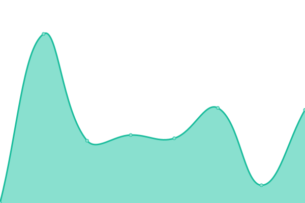

# [📈 Live Status](https://statut.carbubu.fr): <!--live status--> **🟨 Degraded performance**

This repository contains the open-source uptime monitor and status page for [Carbubu](https://carbubu.fr), powered by [Upptime](https://github.com/upptime/upptime).

With [Upptime](https://upptime.js.org), you can get your own unlimited and free uptime monitor and status page, powered entirely by a GitHub repository. We use [Issues](https://github.com/carbubu/upptime/issues) as incident reports, [Actions](https://github.com/carbubu/upptime/actions) as uptime monitors, and [Pages](https://statut.carbubu.fr) for the status page.

<!--start: status pages-->
<!-- This summary is generated by Upptime (https://github.com/upptime/upptime) -->
<!-- Do not edit this manually, your changes will be overwritten -->
<!-- prettier-ignore -->
| URL | Status | History | Response Time | Uptime |
| --- | ------ | ------- | ------------- | ------ |
|  [PlanetHoster](https://www.planethoster.com/fr) | En ligne | [planet-hoster.yml](https://github.com/Carbubu/upptime/commits/HEAD/history/planet-hoster.yml) | 

 2005ms
     
 | 

<a href="https://carbubu.github.io/upptime/history/planet-hoster">100.00%</a>
    

|  [Carbubu](https://carbubu.fr) | Dégradé | [carbubu.yml](https://github.com/Carbubu/upptime/commits/HEAD/history/carbubu.yml) | 

 3670ms
     
 | 

<a href="https://carbubu.github.io/upptime/history/carbubu">99.49%</a>
    

|  [API - Base d'adresse nationale](https://api-adresse.data.gouv.fr/search/?q=8+bd+du+port) | En ligne | [api-base-d-adresse-nationale.yml](https://github.com/Carbubu/upptime/commits/HEAD/history/api-base-d-adresse-nationale.yml) | 

 522ms
     
 | 

<a href="https://carbubu.github.io/upptime/history/api-base-d-adresse-nationale">100.00%</a>
    

<!--end: status pages-->

[**Visit our status website →**](https://statut.carbubu.fr)

## 📄 License

- Powered by: [Upptime](https://github.com/upptime/upptime)
- Code: [MIT](./LICENSE) © [Carbubu](https://carbubu.fr)
- Data in the `./history` directory: [Open Database License](https://opendatacommons.org/licenses/odbl/1-0/)
